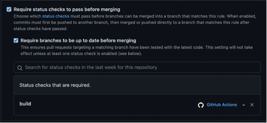

## Bevarelse av kandidat 	1006

## Del 1:

Beskriv med egne ord;

### Hva er utfordringene med dagens systemutviklingsprosess - og hvordan vil innføring av DevOps kunne være med på å løse disse? Hvilke DevOps prinsipper blir brutt?
* Separasjon av avdelinger
* Utviklere er ikke en del av Ops/QA
* QA forstår kanskje ikke kravene, bare at den mislykkes.
* Manuell kontroll av alle QA-relaterte prosesser er treg og byråkratisk
* DevOps kan bidra til bedre å integrere og kommunisere de nå forskjellige avdelingene
* DevOps kan med automatisering bidra til å lette og fremskynde utgivelser og dekke nye testscenarier

### En vanlig respons på mange feil under release av ny funksjonalitet er å gjøre det mindre hyppig, og samtidig forsøke å legge på mer kontroll og QA. Hva er problemet med dette ut ifra et DevOps perspektiv, og hva kan være en bedre tilnærming?
* Hovedproblemet er at tilbakemeldingssløyfen fra kunder og for utviklere er tregere, slik at måneder kan brukes på noe som senere ikke blir brukt.
* Ingen omtale av noen pipeline
* Bruker ikke containers til “immutable releases”
* Bruker ikke noen "connection" mellom kode og release
* Mangel av noe test env

### Teamet overleverer kode til en annen avdelng som har ansvar for drift - hva er utfordringen med dette ut ifra et DevOps perspektiv, og hvilke gevinster kan man få ved at team han ansvar for både drift- og utvikling?
* Separation of concerns er et problem fordi hver avdeling ikke har konteksten for hvordan prosessen som helhet ser ut.
* DevOps kan hjelpe slik at alle involverte har en generell forståelse av hva som skjer hvor og et felles grunnlag for hvordan prosessene, koden, release osv. fungerer og hvordan kan forbedres. 

### Å release kode ofte kan også by på utfordringer. Beskriv hvilke- og hvordan vi kan bruke DevOps prinsipper til å redusere eller fjerne risiko ved hyppige leveraner.
* Smaller releases -> less changes, easier to test
* Often releases -> catch errors more often and fix them as they rise
* Small incremental changes are easier to test and reason about

## Del 2:

### Oppgave 3:
* Protection of main branch:
* På github repository gå til Settings --> Branches
* 
* Velg Add branch protection rule
* Skriv "main" branch name pattern felt
* 
* Velg Require pull request before merging
* 
* Velg require status check pass before merging
* And add to status check that required: build
* 

## Del 3:

### Oppgave 1:
* Det feiler fordi det har login felter i docker.yml filen, men ikke secrets i repo for å logge inn
* Vi må legge til repository secrets til github for dockerhub username og access token.

### Oppgave 3:
* Først sensur logge inn  i sin AWS konto, åpne Cloud 9 og clone repo der.
* Da skal du bygge opp ny container med følgende kommand
* docker build . --tag <give the image a name>
* Neste steg er å kjøre den containeren med kommand
* docker run <tag_name>
* Neste steg er å logge på docker med følgende command:
* docker login
* docker tag <tag> <dockerhub_username>/<tag_remote>
* docker push <username>/<tag_remote>
* Da får man tag på dockerhub.

* Etterpå cd til repo og kjøre følgende kommand på cloud 9 terminalen for å autentisere docker med AWS ECR
* aws ecr get-login-password --region eu-west-1 | docker login --username AWS --password-stdin 244530008913.dkr.ecr.eu-west-1.amazonaws.com
* Neste steg er å pushe container image til ECR repository. Må kjøre følgende kommand
* docker build -t <ditt tagnavn> .
* docker tag <ditt tagnavn> 244530008913.dkr.ecr.eu-west-1.amazonaws.com/<ditt ECR repo navn>
* docker push 244530008913.dkr.ecr.eu-west-1.amazonaws.com/<ditt ECR repo navn>

* For github actions du må lage AWS secret key id og AWS secret key og legge til github repository secrets
* Og deretter må du endre tag name og ECR repository name på docker.yml filen som vises på bildet

* 

* Og da får du pushet container image til ECR

## Del 4:

## Del 5:
### Oppgave 1:
* Terraform feiler med å opprette ny bucket med samme navn fordi i følge AWS bucket navn må være unik.
* https://docs.aws.amazon.com/AmazonS3/latest/userguide/bucketnamingrules.html
* Det forsøker å opprette ny bucket fordi vi har ikke fikset backen delen i provider.tf filen.
* Vi trenger den delen for å lage terraform state og laste til bucket, og etter det når vi kjører terraform init/plan/apply med samme bucket navn, det overskriver det vi har.
* Det prøver ikke å lage ny bucket.